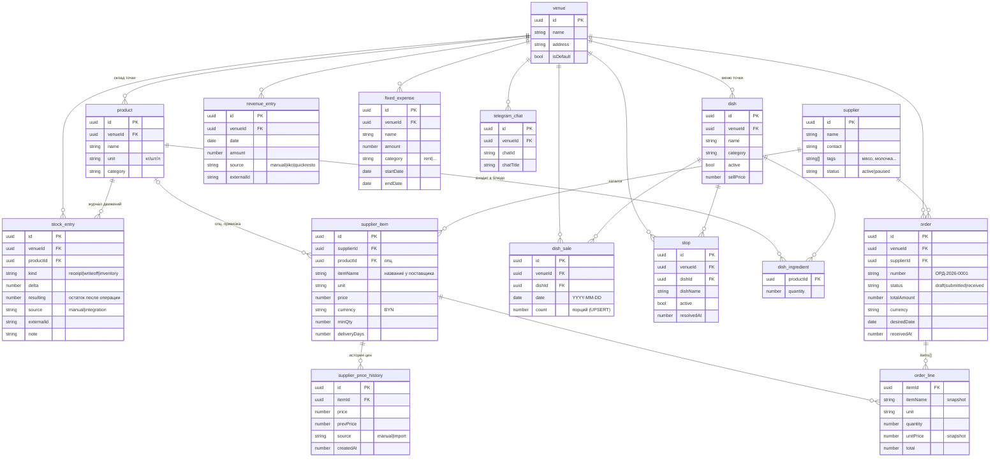

# Модель данных Orakul

## Хранилище

Всё лежит в **одном зашифрованном JSON-файле** [app/data/store.enc](app/data/store.enc) — плоский массив `records[]`, где у каждой записи есть поле `type` (дискриминатор) и общий заголовок `{ id, createdAt, updatedAt, venueId? }`. Перечень всех типов — в [app/shared/scopedTypes.json](app/shared/scopedTypes.json) + ещё несколько «глобальных» (supplier, supplier_item, venue, telegram_chat).

Отдельно — append-only журнал аудита [app/data/audit.jsonl](app/data/audit.jsonl) (create/update/delete по каждой записи).

Часть типов **venue-scoped** (`product`, `stock_entry`, `dish`, `dish_sale`, `stop`, `order`, `revenue_entry`, `fixed_expense`, `telegram_chat`, `recommendation_action`) — у каждой записи есть `venueId`. Часть **общая на всю инсталляцию** (`venue`, `supplier`, `supplier_item`, `supplier_price_history`) — каталог поставщиков шарится между точками.

## ER-схема

> `dish_ingredient` и `order_line` — это **не отдельные записи**, а вложенные массивы внутри `dish.ingredients[]` и `order.items[]` соответственно. На диаграмме показаны как сущности только для наглядности связей.

## Откуда что берётся

| Запись | Создаётся | Файл-источник |
|---|---|---|
| `venue` | Авто-миграция при первом запуске («Точка 1»), потом через UI | [app/server/migrations.js](app/server/migrations.js#L49) |
| `product` | Юзер в UI вкладки «Склад» | [StockTab.jsx:201](app/client/src/components/tabs/StockTab.jsx#L201) |
| `stock_entry` | Юзер в UI: приход / списание / инвентаризация (модалка в карточке товара) | [StockTab.jsx:155](app/client/src/components/tabs/StockTab.jsx#L155) |
| `supplier` | Юзер в UI вкладки «Поставщики» | [SupplierForm.jsx:17](app/client/src/components/suppliers/SupplierForm.jsx#L17) |
| `supplier_item` | Юзер в UI (форма позиции каталога) + импорт прайс-листа из Excel | [ItemForm.jsx:30](app/client/src/components/suppliers/ItemForm.jsx#L30), [ImportPriceListModal.jsx](app/client/src/components/ImportPriceListModal.jsx) |
| `supplier_price_history` | **Сервер сам**, автоматически — на POST и на PUT, если поле `price` изменилось | [records.js:68-79](app/server/records.js#L68-L79), [records.js:107-118](app/server/records.js#L107-L118) |
| `order` | Юзер в 3-шаговом мастере (поставщик → позиции → дата). Номер `ОРД-YYYY-NNNN` присваивается сервером | [OrderWizard.jsx:34](app/client/src/components/orders/OrderWizard.jsx#L34), [records.js:15-25](app/server/records.js#L15-L25) |
| `dish` + `ingredients[]` | Юзер в UI «Меню» (выбор продуктов из склада через picker) | [MenuTab.jsx:115](app/client/src/components/tabs/MenuTab.jsx#L115) |
| `dish_sale` | Юзер вручную в модалке «продажи дня». **Upsert** по (dishId, date, venueId) | [shared/dishSales.js](app/shared/dishSales.js) |
| `stop` | Юзер в UI «Стопы»; снятие со стопа — это `update { active:false, resolvedAt }` | [StopTab.jsx:176](app/client/src/components/tabs/StopTab.jsx#L176) |
| `revenue_entry` | (1) Юзер вручную в «Финансы». (2) Плагины iiko / Quick Resto при синке — с `source` и `externalId` для дедупликации | [SettingsModal.jsx:44](app/client/src/components/tabs/finance/SettingsModal.jsx#L44), [integrations/iiko.js:29-41](app/integrations/iiko.js#L29-L41), [integrations/quickresto.js](app/integrations/quickresto.js) |
| `fixed_expense` | Юзер в «Финансы → Постоянные расходы» | [SettingsModal.jsx:97](app/client/src/components/tabs/finance/SettingsModal.jsx#L97) |
| `telegram_chat` | **Сервер сам** — когда юзер пишет `/start` боту в зарегистрированном чате, бот добавляет запись | [server/telegram.js:215-228](app/server/telegram.js#L215-L228) |
| `recommendation_action` | Юзер в UI «Рекомендации» — принять/скорректировать/отклонить | [utils/recommendations.js](app/client/src/utils/recommendations.js) |

## Связки поставщики ↔ склад

Главный мост — `supplier_item.productId`. **Он опциональный** ([ItemForm.jsx:55](app/client/src/components/suppliers/ItemForm.jsx#L55)): позицию у поставщика можно завести «свободным вводом» (productId = null) или привязать к товару склада. Привязка нужна, чтобы:

- считать **себестоимость блюд** ([shared/dishCost.js](app/shared/dishCost.js)) — берём цену из `supplier_item` по productId, выбираем минимальную среди активных поставщиков;
- искать **аналоги дешевле** в рекомендациях;
- алертить **скачки цен** — на PUT `supplier_item` сервер сравнивает `prev.price ≠ next.price`, пишет в `supplier_price_history` и шлёт уведомление в Telegram ([records.js:133-136](app/server/records.js#L133-L136), [server/alerts.js](app/server/alerts.js)).

`order.items[]` хранит **снэпшот** цены и названия (`unitPrice`, `itemName`) на момент создания заявки — даже если в каталоге потом поменяют цену, в исторической заявке останется фактическая.

## Каскадные удаления

При `DELETE` сервер сам убирает связанные записи ([records.js:144-158](app/server/records.js#L144-L158)):

- удаляешь `supplier` → удаляются все его `supplier_item` и их `supplier_price_history`;
- удаляешь `supplier_item` → удаляется его `supplier_price_history`.

Удаление `product` или `dish` каскадов **не делает** — `stock_entry` и `dish_sale` остаются как историческая запись (для P&L).
